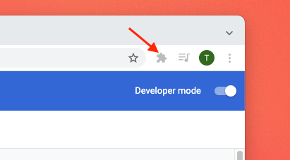
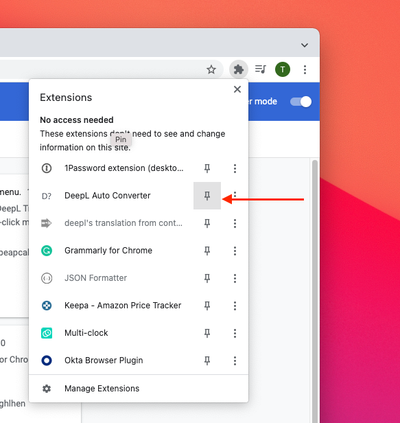
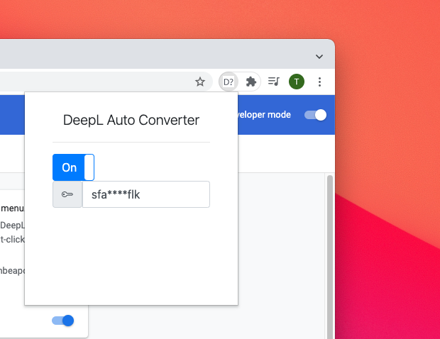

# How to use 

[日本語版](HOW_TO_USE.ja.md)

This guide will show you how to use this extension.

## Install

1. Install the extension from your browser extension store.
1. Pin this extension from the `Extensions` icon on the top right of the browser.

1. Get [an API key from Deepl][2].
1. Enter the API key from the Popup menu icon on the top right of the browser.

1. You're ready to go!

## Usage

Once you have added the API key, you can now highlight any text in the pages.

<video src='../resource/video/highlight.mov' width=180/>

Sometimes, you highlight and expect not to translate. In this case, you can disable this by clicking on the `Deepl Auto Converter` icon on the top right of the browser, and change the switch from ON to OFF.

[2]: https://www.deepl.com/

