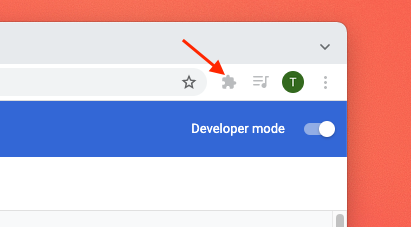
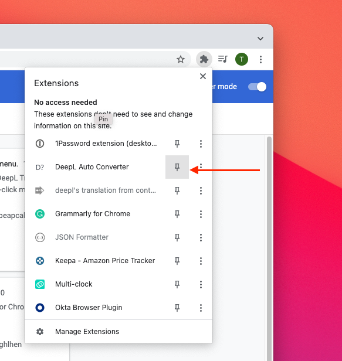
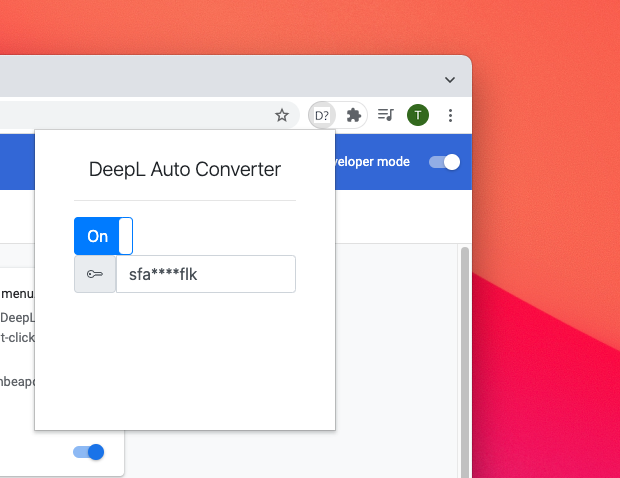

# 使い方

[英語版](HOW_TO_USE.en.md)

ここでは拡張子の使い方を紹介します。

## インストール

1. 拡張子をブラウザのストアからインストールする。
1. ブラウザの右上の「拡張子アイコン」から`Deepl Auto Converter`をピンします。

1. [DeepLからAPIキーを取得][2]します。
1. 右上のポップアップからAPIキーを入力します。

1. ONになっていない場合はONにします。
1. これで準備が完了です。

## Usage

インストール完了後テキストをハイライトするとインラインで日本語に翻訳されます。

<video src='../resource/video/highlight.mov' width=180/>

翻訳を行いたくない場合でもハイライトしてしまう場合があります。これを防ぐために、右上のアイコンからDeepl Auto Converterを開き、ONをOFFに変更します。

[2]: https://www.deepl.com/

